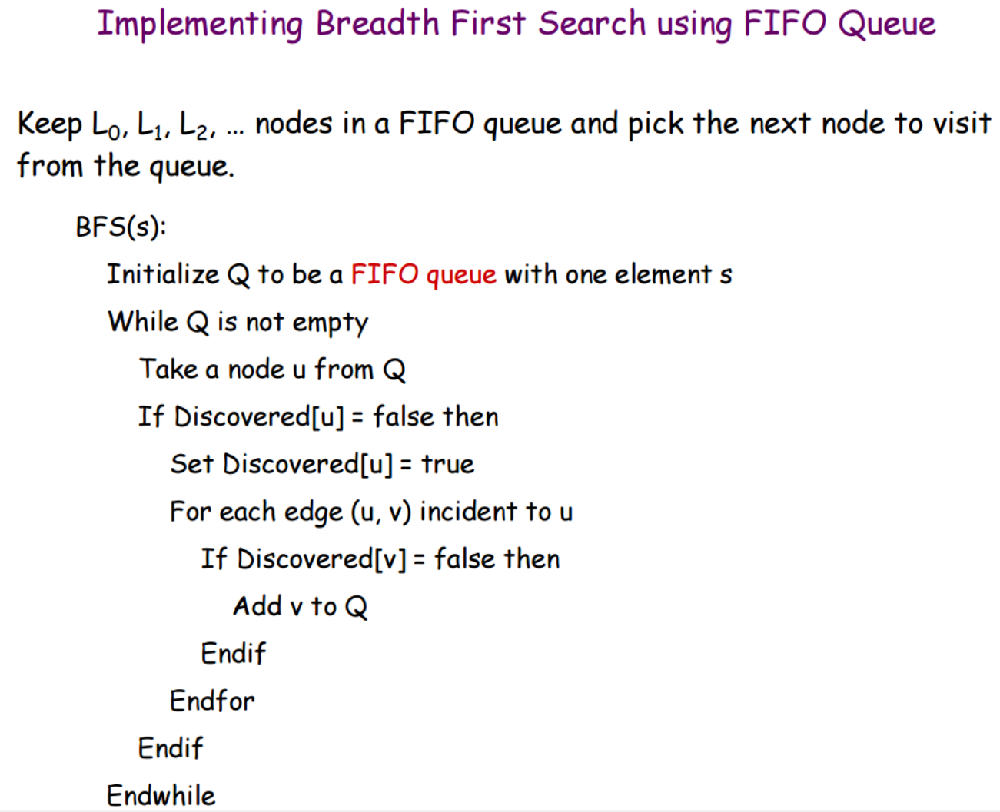
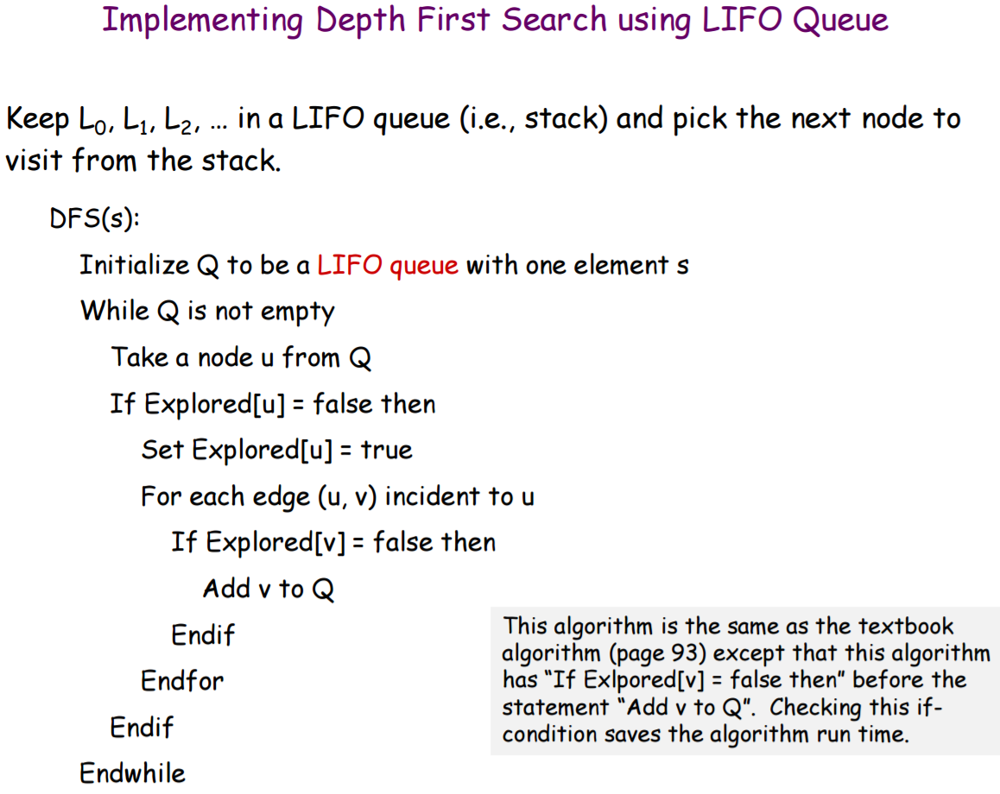
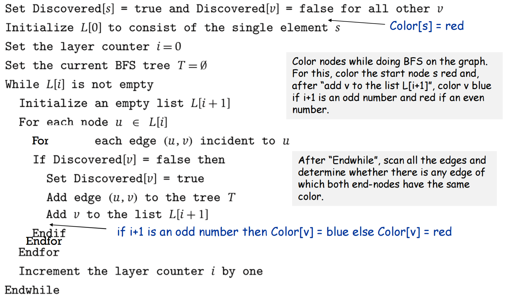
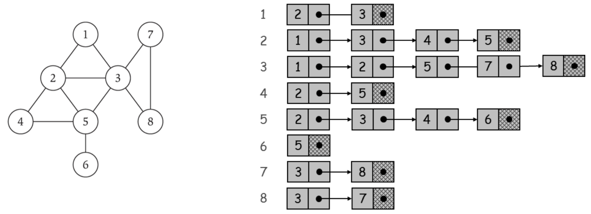
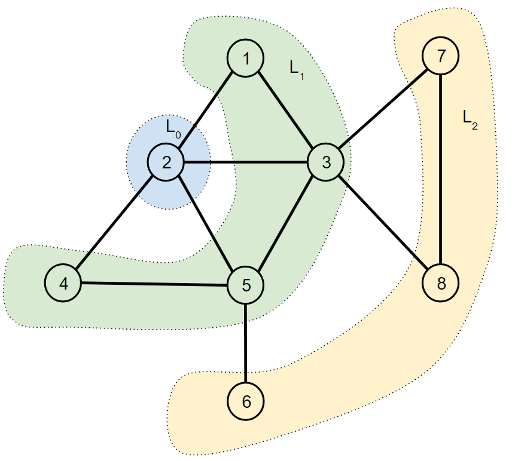

# Graphs Algorithms: Breadth First Search & Depth First Search
- Simple implementation of BFS & DFS in Java using Adjacency List for Graph Representation
- Uses almost identical code for BFS & DFS. BFS uses a LIFO Queue (LinkedList) while DFS uses a FIFO Queue (Stack)
- You can pick any node in the graph & run DFS or BFS from that node
- Ability to repeat & choose a different node or algorithm

## Pseudocode
### Breadth First Search

### Depth First Search

### Breadth First Search With Layers

## Notes
- Constructor automatically creates a graph like this:

- **CODE IS IDENTICAL! The only difference between BFS & DFS is the type of Queue  
BFS uses `LinkedList` (LIFO) while DFS uses `Stack` (FIFO)**  
Some code specific details:
  - BFS: `Queue<Integer> nodeQueue = new LinkedList<Integer>();`  
  vs DFS: `Stack<Integer> nodeQueue = new Stack<Integer>();`
  - BFS: `int nodeRemovedFromQueue = nodeQueue.remove();`  
  vs DFS: `int nodeRemovedFromQueue = nodeQueue.pop();`  
  **`remove()` vs `pop()`**
- I used a `while loop` and an `iterator` instead of an inner for loop since I'm using `LinkList` for each row in the Adjacency List
- **Calling either method will print the nodes in the order visited by the algorithm**

## BFS Layers `breadthFirstSearchLayers()`
- Uses a different approach for Breadth first search to display the actual layers as BFS ripples outward
- The line `layers.add(new ArrayList<Integer>());` create empty layer each iteration, but results in an extra layer when algorithm terminate.
  - This extra layer is ignored in `printBfsLayers()`  
  `if(!layers.get(i).isEmpty()){`  
    `System.out.print("Layer "+i+":  ");`  
  `}`

BFS Layers shows the layers like this  

